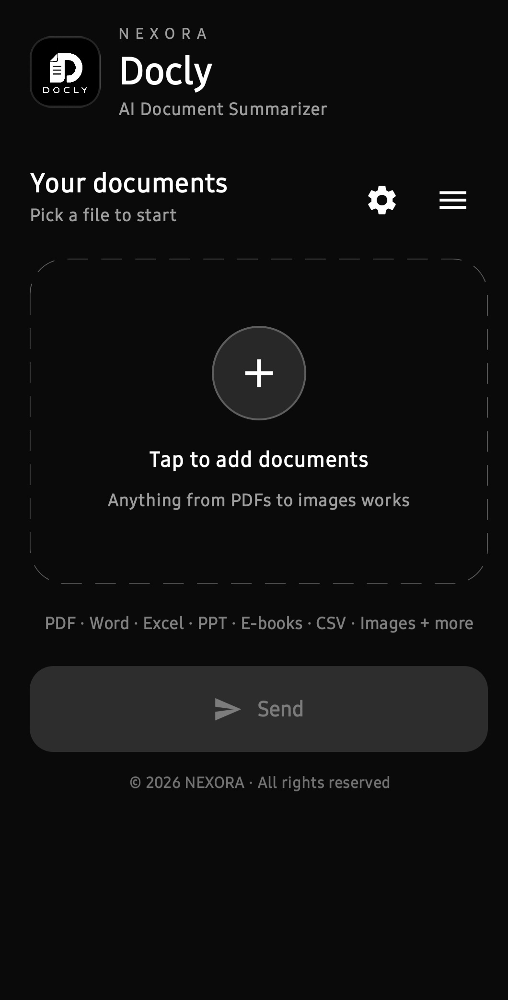

<div align="center">

# Docly

**Sleek, AI-powered document assistant for Android**

PDFs, Word, Excel, PowerPoint, e-books, CSVs and even images — turned into a clean,
short summary in seconds, with a chat to ask anything about your documents.

`Android 10+` · `100% on-device extraction` · `Mistral AI` · `Jetpack Compose`

</div>

---

## Screenshots

<div align="center">

</div>

---

## ✨ Features

- **One-tap summaries** — pick any supported file, get a clean, short (<100 words) summary with the important facts: names, amounts, dates, deadlines, terms.
- **Chat with your document** — ask questions directly; answers are grounded in the document text, with exact values quoted when present — never repeating the summary or an intro line.
- **Handles huge files** — long documents are chunked smartly, summarized part-by-part, then merged into one final summary.
- **85+ output languages** — summaries and chat replies in English, Hindi, Bengali, Spanish, Japanese, Swahili and many more, in proper native script. Includes **Hinglish (Roman Hindi)** — natural Hindi written in English letters, the way it's actually typed in chat.
- **OCR for images** — text inside photos, screenshots and scanned pages is read with ML Kit.
- **Read aloud (TTS)** — every summary (labeled "Read aloud" button) and every AI reply (compact speaker icon) can be read out loud in the selected language. Only the actively speaking button lights up; a loading spinner appears while the engine warms up. Covers 85+ languages with region-variant fallbacks and graceful fallback to English when the device lacks a voice.
- **Calm monochrome design** — dark, minimal Material 3 interface that stays out of your way.
- **Tamper-proof build** — the APK contains an encrypted integrity blob; any byte change, re-sign or repack causes the app to refuse to start (see [Security](#-security)).

## 📄 Supported formats

| Category | Extensions |
|---|---|
| PDF | `pdf` (digital *and* scanned, via OCR) |
| Word | `docx` `doc` `rtf` `odt` |
| Text | `txt` `md` |
| Excel | `xlsx` `xls` `csv` `tsv` |
| PowerPoint | `pptx` `ppt` |
| E-books | `epub` `mobi` `azw` `azw3` |
| Images (OCR) | `jpg` `jpeg` `png` `webp` `tiff` `tif` |

## 🛠 Tech stack

| Layer | Technology |
|---|---|
| Language | Kotlin 2.2 |
| UI | Jetpack Compose · Material 3 · Edge-to-Edge |
| AI | Mistral AI (`open-mistral-nemo`) via REST |
| PDF | PDFBox (Android port) |
| OCR | Google ML Kit Text Recognition |
| Read aloud | Android TextToSpeech (curated 85+ language locale map, chunking, per-button state, fallback) |
| Office/E-books | Custom extractors (Apache POI-style via android-awt, ZIP/XML parsers) |
| Build | Android Gradle Plugin 9.3 · Gradle 9.5 · version catalog |

## 🚀 Getting started

### Requirements

- Android Studio (latest stable) with JDK 17+
- An Android device or emulator running **Android 10 (API 29)+**

### 1. Set your Mistral API key

The build reads the real key from `gradle/wrapper/gradle-wrapper.properties`:

```properties
doclyApiKey=YOUR_MISTRAL_API_KEY_HERE
```

Get a free key at [console.mistral.ai](https://console.mistral.ai) — the free tier
(1 req/sec) is plenty for testing; the app throttles and retries automatically.

> ⚠️ Never commit your real key. Keep `gradle/wrapper/gradle-wrapper.properties`
> out of version control (or strip the `doclyApiKey` line before pushing).

The key is **not** compiled into the APK as plaintext. At build time the `secgen`
plugin encrypts it into a blob bound to your app's signing certificate (see
[Security](#-security)).

### 2. Build & run

```bash
# Debug APK (includes the embedded security blob + resigning)
./gradlew.bat :app:assembleDebug        # Windows
./gradlew :app:assembleDebug            # macOS/Linux

# Full test suite
./gradlew :app:assembleDebug :app:assembleDebugUnitTest :app:assembleDebugAndroidTest

# Install on a connected device
adb install -r app/build/outputs/apk/debug/app-debug.apk
```

Build output: `app/build/outputs/apk/debug/app-debug.apk`

### 3. Change your key

Edit `doclyApiKey=...` in `gradle/wrapper/gradle-wrapper.properties` and rebuild.
The blob is regenerated on every build — no code changes needed.

## 🔒 Security

Docly ships with an unusual amount of tamper resistance for an Android app:

- **Per-build integrity blob** — a Gradle plugin (`secgen-plugin`, included build)
  runs after packaging, fingerprints **every entry** of the final APK
  (`name:SHA-256` hash per file), encrypts the fingerprint together with your API
  key using **AES-256-GCM**, and injects the ciphertext into
  `assets/security.bin`.
- **Certificate-bound key** — the encryption key is derived from the app's
  signing certificate, so the blob only decrypts under the original signature.
- **Runtime gate** — at app startup, `Protect.init()` re-fingerprints the *installed*
  APK and decrypts the blob. Any of the following makes the app immediately refuse
  to run:
  - a single byte changed anywhere in the APK (dex, resources, manifest, assets…),
  - re-signing with a different certificate,
  - stripped signatures,
  - rooted devices or Frida/debugger attachment.
- **Decoys** — the `BuildConfig` exposes only fake API keys, so naive static
  analysis finds nothing real.

See `app/src/main/java/com/nexora/docly/security/Protect.kt` for the runtime gate
and `secgen-plugin/` for the build-time injection.

> **Note:** no client-side secret is safe against a fully determined attacker on a
> rooted device. For production deployments, consider proxying requests through
> your own backend instead of shipping a key at all.

## 🧱 Project structure

```
docly/
├── app/                          # Main Android app
│   └── src/main/java/com/nexora/docly/
│       ├── MainActivity.kt       # Entry point — Protect.init() runs first
│       ├── data/                 # File extraction (PDF, Office, e-books, OCR)
│       ├── data/ai/              # Mistral API client + summarizer/chunker
│       ├── security/Protect.kt   # Runtime integrity gate
│       ├── ui/                   # Compose screens, theme, components
│       └── util/TtsReader.kt     # Read-aloud engine (85+ language TTS)
├── secgen-plugin/                # Included build: security blob generation
│   └── src/main/kotlin/com/nexora/docly/secgen/SecGenPlugin.kt
├── gradle/libs.versions.toml     # Version catalog
└── gradle/wrapper/gradle-wrapper.properties   # doclyApiKey lives here
```

## 📊 Tests

- **Unit tests** (`app/src/test`) — pure JVM logic.
- **Instrumented tests** (`app/src/androidTest`) — Compose UI tests.

```bash
./gradlew :app:testDebugUnitTest                 # unit tests
./gradlew :app:connectedDebugAndroidTest         # on-device tests
```

## 👤 Developer

**Kunal Sharma** — Android developer at NEXORA.

- GitHub: [kunalsharma0354](https://github.com/kunalsharma0354)
- Discord: [Join the server](https://discord.gg/Bfay2C89f5)
- Email: [Kunalsharma9321@gmail.com](mailto:Kunalsharma9321@gmail.com)

## 📜 License

© 2026 NEXORA · All rights reserved.